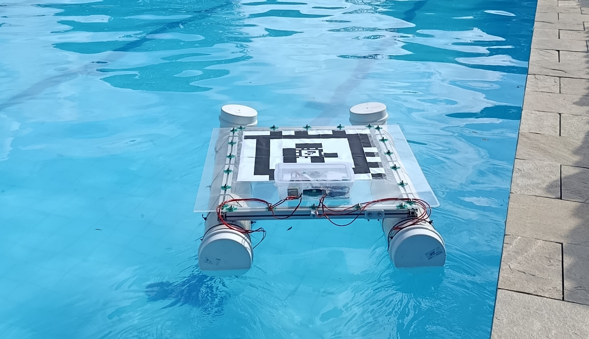

# Projeto Jurandi: Veículo de Superfície Autônomo (ASV)

[](https://laser-robotics.github.io/laser_jurandi_report/)
[](https://www.sphinx-doc.org/)

O **Jurandi** é um Veículo de Superfície Autônomo (ASV — *Autonomous Surface Vehicle*) em formato de catamarã, desenvolvido na Universidade Federal da Paraíba (UFPB) com apoio financeiro da CAPES. A plataforma integra robótica marinha e aérea e foi concebida como base móvel para pouso e decolagem de drones sobre a água.

> **Relatório completo:** [laser-robotics.github.io/laser_jurandi_report](https://laser-robotics.github.io/laser_jurandi_report/)



## Sumário

- [Apresentação](#apresentação)
- [Objetivos](#objetivos)
- [Materiais e componentes](#materiais-e-componentes)
- [Construção e integração](#construção-e-integração)
- [Testes](#testes)
- [Resultados e conclusões](#resultados-e-conclusões)
- [Documentação Sphinx](#documentação-sphinx)

## Apresentação

Os ASVs são plataformas robóticas utilizadas em monitoramento da qualidade da água, mapeamento batimétrico e inspeções visuais contínuas. O Jurandi amplia essas possibilidades ao servir como uma plataforma estável para operações colaborativas entre veículos aquáticos e aéreos.

[](https://www.youtube.com/watch?v=ryNO8USSduo)

*Clique na imagem para assistir à apresentação no YouTube.*

## Objetivos

### Objetivo geral

Construir, integrar e validar o hardware e o software de controle do catamarã Jurandi, estabelecendo uma plataforma robótica autônoma, funcional e dinamicamente estável para navegação de precisão.

### Objetivos específicos

| Frente | Objetivo |
| --- | --- |
| Integração de hardware | Estruturar a montagem mecânica e integrar a controladora Pixhawk 6C ao sistema de propulsão. |
| Configuração de firmware | Parametrizar o BLHeli nos ESCs para assegurar o acionamento preciso e responsivo dos motores. |
| Telemetria e comunicação | Estabelecer um link de rádio para dados em tempo real e operação via Estação de Controle em Solo. |
| Testes de campo | Validar locomoção, estabilidade de flutuação e resposta aos comandos em ambiente aquático real. |

## Materiais e componentes

A seleção dos componentes priorizou flutuabilidade, rigidez estrutural, resistência ao ambiente aquático e capacidade de processamento para navegação autônoma.

| Subsistema | Componente | Especificação |
| --- | --- | --- |
| Cascos | Tubos de PVC | 200 mm de diâmetro × 1 m de comprimento |
| Berço | Perfis de alumínio | 1,0 × 0,8 m |
| Deck | Chapa de acrílico | 1,02 × 1,16 m; fixação M8 |
| Controle | Pixhawk 6C | IMUs internas e fusão sensorial EKF |
| Potência | Holybro PM07 | Distribuição, regulação e medição elétrica |
| Energia | Bateria LiPo Gens Ace | 4S; 14,8 V nominal |
| Cabeamento | Fio flexível de silicone | 22 AWG |
| Comunicação | Rádio de telemetria | Enlace bidirecional MAVLink |
| Propulsão | ESCs BLHeli e motores *brushless* | Acionamento bidirecional |

### Estrutura mecânica

Os dois cascos de PVC possuem joelhos de 45° na proa e tampões herméticos na popa. Um berço de perfis de alumínio sustenta o deck de acrílico, que acomoda o compartimento eletrônico e funciona como área de pouso para drones. Abraçadeiras de nylon fixam os cascos, enquanto peças em PETG impressas em 3D apoiam os componentes internos.

| Casco | Berço | Deck instalado |
| :---: | :---: | :---: |
|  |  |  |

### Eletrônica, potência e propulsão

A Pixhawk 6C executa a navegação, o controle PID e a fusão sensorial. O módulo PM07 distribui a alimentação e monitora tensão e corrente. A bateria LiPo 4S alimenta os motores submersíveis, controlados por ESCs com firmware BLHeli. O enlace MAVLink permite acompanhar e comandar a embarcação pela Estação de Controle em Solo.

## Construção e integração

A construção foi dividida em três frentes: montagem mecânica, integração eletrônica e configuração do sistema de controle.

### 1. Montagem mecânica

1. **Preparação dos cascos:** corte dos tubos de PVC, instalação dos joelhos de 45° na proa e vedação da popa com tampões e adesivo próprio para PVC.
2. **Montagem do berço:** união dos perfis de alumínio com cantoneiras metálicas, conectores em PETG e fixações parafusadas, mantendo o conjunto alinhado e rígido.
3. **Instalação do deck:** marcação, perfuração e fixação da chapa de acrílico ao berço com parafusos e porcas M8.
4. **Fixação dos cascos e propulsores:** instalação dos motores em suportes impressos em 3D e ancoragem de cada casco ao berço com aproximadamente 16 abraçadeiras de nylon.

### 2. Integração eletrônica

- Extensão dos cabos dos motores com fio de silicone 22 AWG e conectores *bullet* para facilitar a manutenção.
- Organização da Pixhawk 6C, PM07, telemetria e bateria em compartimento vedado.
- Posicionamento da controladora próximo ao centro de gravidade e sobre material amortecedor.
- Instalação do GPS e da bússola externa em haste elevada, afastados dos cabos de potência.

### 3. Configuração

1. Atualização dos ESCs com BLHeli e ativação do modo bidirecional.
2. Definição do ponto neutro próximo de 1500 µs, com comandos acima para avante e abaixo para ré.
3. Calibração do acelerômetro, giroscópio e bússola da Pixhawk 6C.
4. Configuração do *frame* Rover/Boat e da mistura diferencial entre bombordo e estibordo.

> A validação em bancada deve anteceder qualquer ensaio na água: confirme o neutro dos motores, o sentido de rotação, a telemetria e a orientação dos sensores.

Leia o procedimento detalhado em [Construção e Integração](./source/construcao.md) ou na [versão publicada](https://laser-robotics.github.io/laser_jurandi_report/construcao.html).

## Testes

Os ensaios foram organizados de forma progressiva para reduzir riscos.

| Etapa | Verificações |
| --- | --- |
| Bancada | Sentido de rotação, comandos de frente/ré/curvas, telemetria e calibração dos sensores. |
| Campo | Estanqueidade, distribuição de peso, flutuabilidade, estabilidade e resposta hidrodinâmica. |

[](https://www.youtube.com/watch?v=8dZGqTz3dco)

*Clique na imagem para assistir ao teste integrado no YouTube.*

## Resultados e conclusões

A integração demonstrou a viabilidade do uso da Pixhawk 6C com ESCs BLHeli em uma plataforma marinha autônoma. Os principais resultados foram:

- comunicação estável com a Estação de Controle em Solo;
- acionamento responsivo e bidirecional dos propulsores;
- manobrabilidade por diferença de rotação entre bombordo e estibordo;
- estrutura modular com flutuabilidade e estabilidade adequadas aos ensaios.

Os desafios mais relevantes estiveram na compatibilidade elétrica, na comunicação entre os componentes e na parametrização da controladora. Como continuidade, estão previstos o refinamento dos parâmetros PID, a integração de novos sensores, missões autônomas de maior alcance e testes repetidos de pouso e decolagem de drones.

## Documentação Sphinx

### Estrutura do relatório

```text
source/
├── index.md          Página inicial
├── apresentacao.md   Contexto e objetivos
├── materiais.md      Estrutura, eletrônica e software
├── construcao.md     Montagem e integração
├── testes.md         Validação em bancada e em campo
├── conclusao.md      Resultados e trabalhos futuros
└── images/           Fotografias e ilustrações
```

### Gerar o site localmente

Requer Python 3.10 ou superior.

```bash
python -m venv venv
source venv/bin/activate
python -m pip install -r requirements.txt
make html
```

Para visualizar com uma origem HTTP local, evitando bloqueios de conteúdo incorporado:

```bash
python -m http.server 8000 --directory build/html
```

Abra `http://localhost:8000` no navegador.

### Publicação

O envio de alterações para a branch `main` aciona o fluxo em `.github/workflows/sphinx.yml`. O GitHub Actions gera o site e o publica no GitHub Pages. Em **Settings → Pages**, a origem de publicação deve estar definida como **GitHub Actions**.

## Instituição e apoio

Projeto desenvolvido na **Universidade Federal da Paraíba (UFPB)** com apoio da **CAPES**.