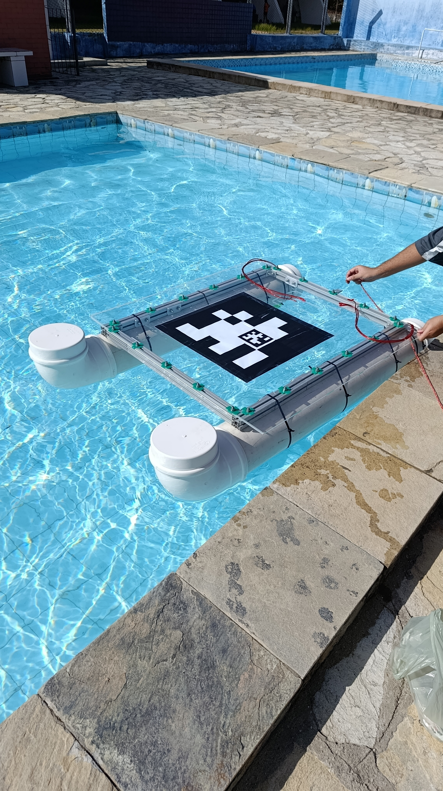

# Apresentação e Objetivos

<video src="_static/jurandi_test_video_2.mp4" width="100%" controls>
  Seu navegador não suporta a tag de vídeo.
</video>

O projeto **Jurandi** consiste no desenvolvimento de um Veículo de Superfície Autônomo (ASV — *Autonomous Surface Vehicle*) em formato de catamarã. Desenvolvido na Universidade Federal da Paraíba (UFPB) com o apoio financeiro da CAPES, o projeto busca inovar na integração tecnológica entre robótica marinha e aérea.

Os ASVs são plataformas robóticas essenciais para operações complexas em ambientes aquáticos, viabilizando tarefas como monitoramento da qualidade da água, mapeamento batimétrico e inspeções visuais contínuas, mitigando a exposição de operadores humanos a áreas de risco. Especificamente, a construção do Jurandi tem como finalidade principal atuar como uma base móvel autônoma para o pouso e decolagem de Veículos Aéreos Não Tripulados (VANTs/drones) sobre a água. Essa integração cria uma arquitetura colaborativa híbrida, potencializando missões que demandam interação direta e contínua entre os domínios aéreo e aquático.

## Objetivo Geral
Construir, integrar e validar o hardware e o software de controle do catamarã Jurandi, estabelecendo uma plataforma robótica autônoma, funcional e dinamicamente estável para navegação de precisão.

## Objetivos Específicos
* **Integração de Hardware:** Estruturar a montagem mecânica e integrar de forma coesa a controladora de voo Pixhawk 6C ao sistema de propulsão.
* **Configuração de Firmware:** Parametrizar o firmware BLHeli nos Controladores Eletrônicos de Velocidade (ESCs) para assegurar o acionamento preciso e responsivo dos motores.
* **Telemetria e Comunicação:** Estabelecer um link de rádio robusto para o envio de dados em tempo real e operação segura via Estação de Controle em Solo (GCS - *Ground Control Station*).
* **Testes de Campo:** Validar a dinâmica de locomoção, a estabilidade de flutuabilidade e a confiabilidade na resposta aos comandos de navegação em um ambiente aquático real.

*(Exemplo de como colocar uma imagem no Markdown:)*
