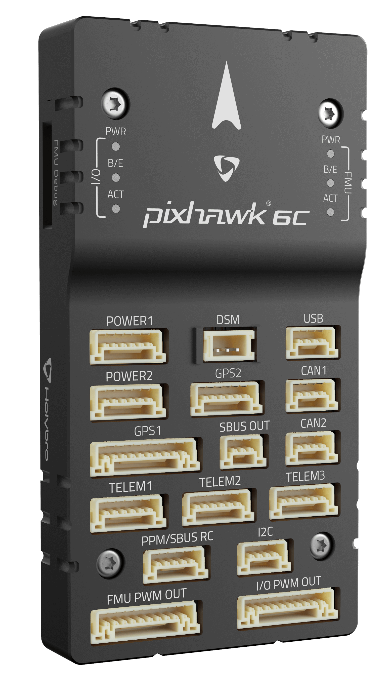
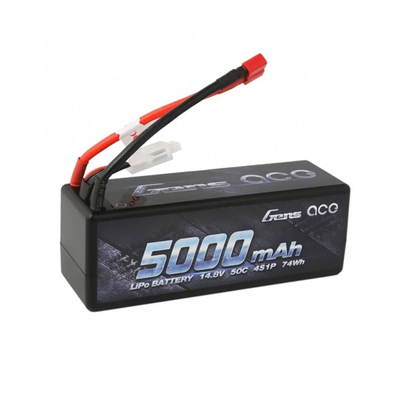
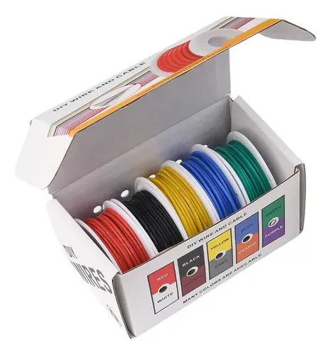
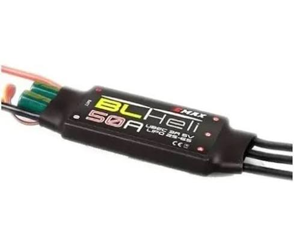

## Materiais e Componentes

<video src="_static/jurandi_and_drone.mp4" width="100%" controls>
  Seu navegador não suporta a tag de vídeo.
</video>

Para o desenvolvimento do catamarã Jurandi, realizou-se a seleção criteriosa de componentes de hardware e software, visando assegurar a flutuabilidade adequada, integridade estrutural e o processamento computacional robusto exigido para a navegação autônoma de superfície.

### Estrutura Mecânica 

* **Casco do Catamarã:** Estrutura de duplo casco projetada para otimizar a estabilidade hidrodinâmica e minimizar o coeficiente de arrasto. Cada casco é constituído por um tubo de cloreto de polivinila (PVC) com 200 mm de diâmetro e 1 m de comprimento, dotado de defletores angulados (joelhos de 45°) na proa para corte de marolas e tampões de vedação hermética na popa.

* **Berço do Catamarã:** Armação metálica de alta rigidez em formato de paralelepípedo, confeccionada com perfis estruturais de alumínio. Destinada à sustentação do convés principal, apresenta dimensões de 1,0 x 0,8 m, garantindo leveza e resistência à corrosão.

* **Deck do Catamarã:** Chapa de acrílico plana com dimensões de 1,02 x 1,16 m. Atua primariamente como convés dielétrico para a acomodação do invólucro estanque de componentes eletrônicos e como heliponto rígido para a aterrissagem dos drones, distribuindo a carga de impacto uniformemente pelo berço metálico através de fixações com parafusos e porcas M8. 

* **Abraçadeiras de Fixação Estrutural:** Cintas de nylon de alta tenacidade com 500 mm de comprimento. Empregadas para ancorar mecanicamente os cascos tubulares ao berço de alumínio, mitigando a torção longitudinal e consolidando o monobloco estrutural.

* **Suportes de Acomodação Interna:** Componentes projetados via modelagem CAD 3D paramétrica e manufaturados por manufatura aditiva (impressão 3D FDM). Recomenda-se a utilização de polímeros com elevada resistência térmica e mecânica, como o PETG, garantindo o isolamento contra vibrações da eletrônica embarcada no ambiente marinho.

### Eletrônica, Potência e Propulsão

* **Controladora de Voo (FCU):** Unidade de processamento modular Pixhawk 6C. Encarregada da execução dos algoritmos de navegação autônoma, malhas de controle PID e fusão avançada de dados sensoriais (EKF) a partir de suas IMUs internas amortecidas e magnetômetro.

* **Módulo de Gerenciamento de Potência (PMU):** Placa de distribuição de potência Holybro PM07. Desempenha o papel crítico de fornecer regulação de tensão contínua e redundante para a controladora de voo e periféricos, além de realizar a amostragem em tempo real da corrente drenada e da tensão total do sistema para a telemetria.

* **Acumulador de Energia:** Bateria de Polímero de Lítio (LiPo) de 4 células (4S - 14.8V nominal) da fabricante Gens Ace. Dimensionada para suportar altas taxas de descarga contínua impostas pelos propulsores marítimos, garantindo a reserva energética necessária para missões de média a longa duração.

* **Cabeamento e Interconexões de Sinal:** Cabeamento lógico e de potência secundária estruturado com fios isolados em silicone flexível de bitola 22 AWG. Esta especificação assegura elevada resiliência térmica, baixa impedância ôhmica para correntes moderadas e excelente imunidade à fadiga mecânica gerada pela vibração contínua dos motores.

* **Rádio Transceptor de Telemetria:** Módulo de RF configurado para o estabelecimento de um link de dados bidirecional criptografado via protocolo MAVLink, permitindo o monitoramento telemétrico e intervenções de controle em tempo real pela Estação de Controle em Solo (GCS).

* **Controladores Eletrônicos de Velocidade (ESCs):** Módulos de comutação trifásica dedicados ao acionamento dos motores. Operam suportando protocolos digitais de alta frequência (como DShot) e modulação PWM padrão, com suporte a correntes de pico elevadas.

* **Propulsores Submersíveis:** Motores *brushless* de baixo KV, intrinsecamente marinizados e vedados (proteção IP avançada). Projetados para operar submersos, oferecem tração hidrodinâmica eficiente através de hélices otimizadas e são altamente resistentes à corrosão hídrica.

### Software e Firmware

* **Sistemas de Navegação e GCS:** Operação regida pelos stacks ArduRover ou PX4 na controladora Pixhawk. O monitoramento remoto, planejamento de rotas por *waypoints* georreferenciados e a calibração de malhas sensoriais são conduzidos via software Mission Planner ou QGroundControl.
