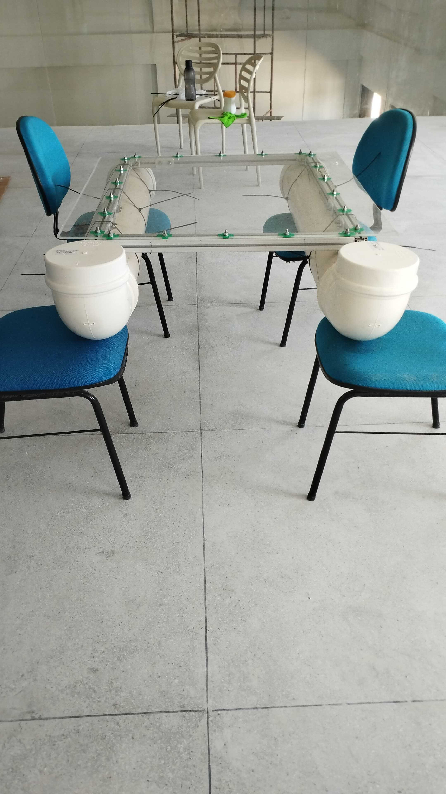
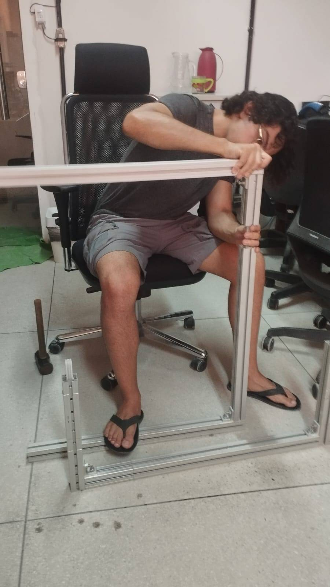
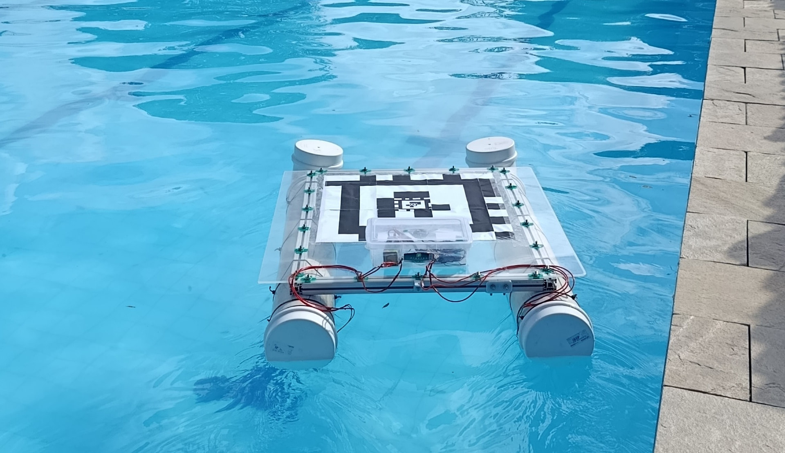
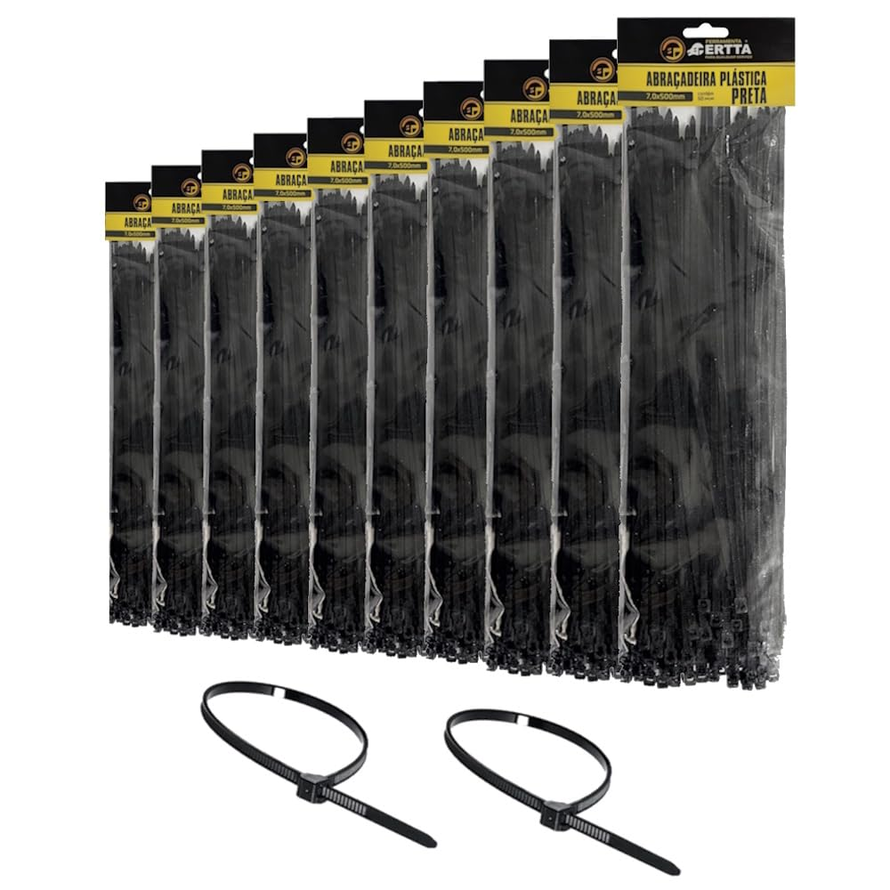
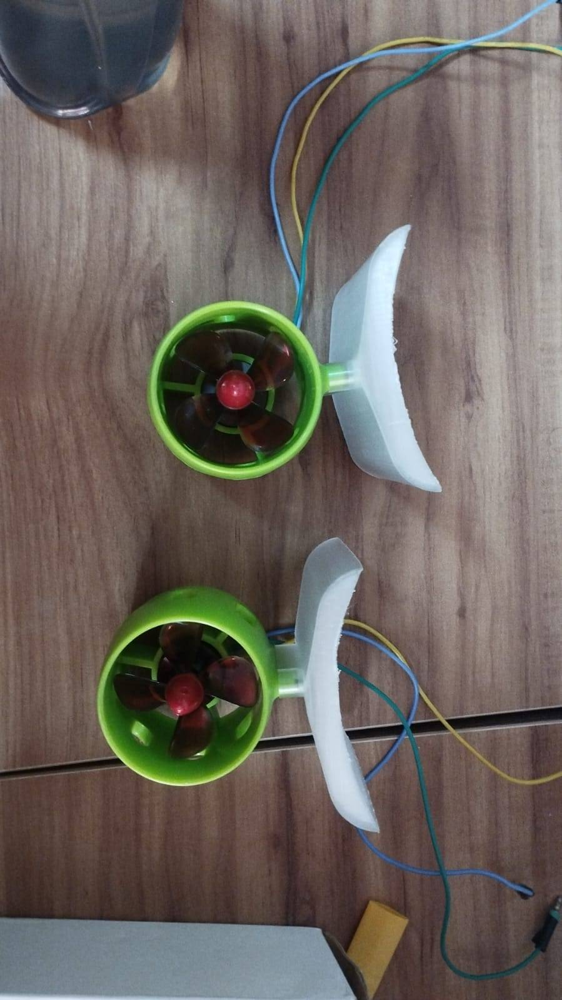
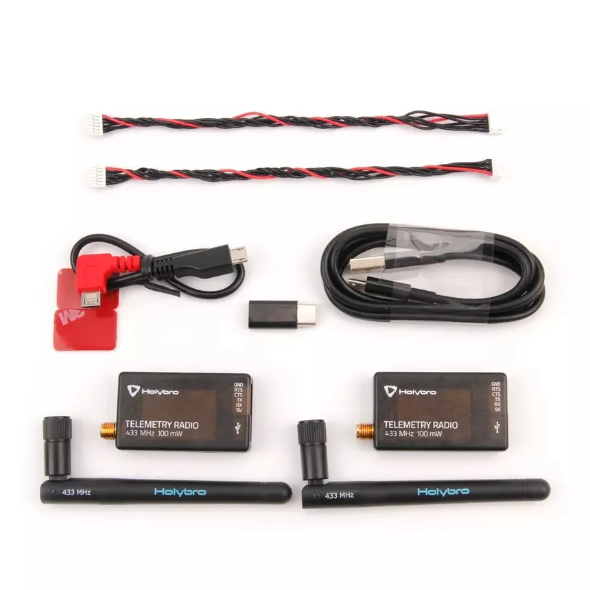
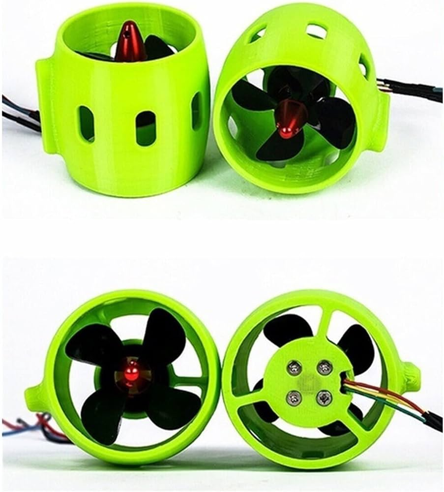
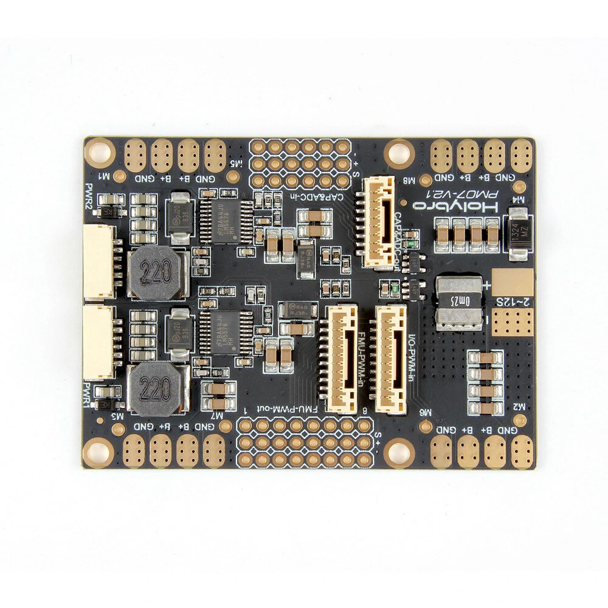
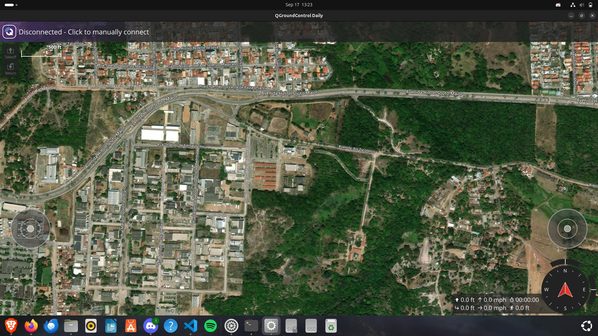

# Materiais e Componentes

<!-- Inserção do vídeo (ajuste o nome do arquivo para o vídeo correspondente) -->
<video src="https://github.com/LASER-Robotics/laser_jurandi_report/raw/main/source/_static/jurandi_and_drone_1.mp4" width="100%" controls>
  Seu navegador não suporta a tag de vídeo.
</video>

Para o desenvolvimento do catamarã Jurandi, realizou-se a seleção criteriosa de componentes de hardware e software, visando assegurar a flutuabilidade adequada da embarcação e o processamento computacional robusto exigido para a navegação autônoma.
## Estrutura Mecânica 

* **Casco do Catamarã:** Estrutura de duplo casco projetada para garantir estabilidade hidrodinâmica. Cada casco é constituído por um tubo de PVC com 200 mm de diâmetro e 1 m de comprimento, contendo um joelho de 45° acoplado em uma extremidade (proa) e um tampão de vedação na outra (popa).

* **Berço do Catamarã:** Armação metálica em formato de paralelepípedo, confeccionada com perfis de alumínio, destinada à sustentação do convés (deck) de acrílico. Apresenta dimensões de 1,0 x 0,8 m.

* **Deck do Catamarã:** Chapa de acrílico com dimensões de 1,02 x 1,16 m, que atua como convés para acomodação do invólucro de componentes eletrônicos e como plataforma de pouso para os drones. A fixação ao berço de alumínio foi realizada utilizando parafusos e porcas M8. 

* **Abraçadeiras de Nylon:** Com 500 mm de comprimento, foram empregadas para fixar firmemente os cascos ao berço de alumínio, consolidando o acoplamento estrutural entre cascos, berço e convés.

* **Suportes de Fixação:** Componentes modelados em CAD e manufaturados sob medida (via impressão 3D) para a acomodação e fixação segura da eletrônica embarcada.

## Eletrônica e Propulsão

* **Controladora de Voo (FCU):** Unidade Pixhawk 6C, responsável pelo processamento dos algoritmos de navegação, fusão de dados sensoriais (IMU, magnetômetro) e emissão de sinais de controle.

* **Módulo de Telemetria:** Rádio transceptor configurado para comunicação de dados bidirecional em tempo real com a Estação de Controle em Solo (GCS).

* **Controladores Eletrônicos de Velocidade (ESCs):** Módulos dedicados ao acionamento e controle de rotação dos motores, operando com suporte a protocolos de alta velocidade (DShot ou PWM).

* **Propulsores:** Motores *brushless* marinizados (à prova d'água), projetados para garantir tração hidrodinâmica eficiente e resistência à corrosão.

* **Sistema de Alimentação:** Composto por bateria de Polímero de Lítio (LiPo) e Módulo de Potência (*Power Module*), assegurando a distribuição isolada e segura de tensão elétrica para a controladora e para os propulsores.

## Software e Firmware

* **Firmware de Controle:** BLHeli para a parametrização avançada dos ESCs, e os sistemas ArduRover ou PX4 embarcados na Pixhawk para autonomia de superfície.

* **Estação de Controle em Solo (GCS):** Software Mission Planner ou QGroundControl, utilizados para o monitoramento telemétrico, planejamento de missões e calibração remota.
